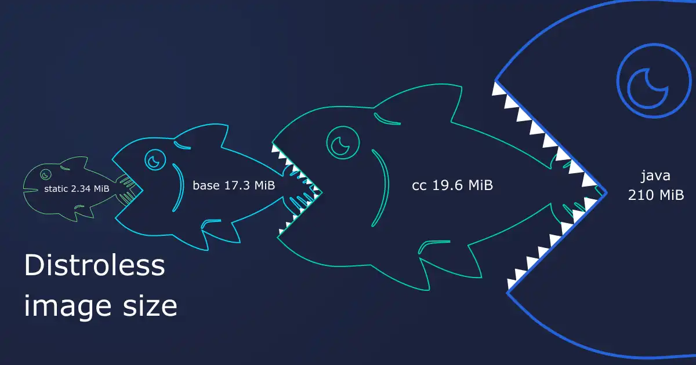

# Technical Demo Study Notes

## 1. Tools and Packages

### 1.1 Build Tools

- **Autoconf**: Produces shell scripts that automatically configure software source code packages to adapt to many kinds of Unix-like systems.
- **Dpkg-dev**: A collection of tools used to create Debian packages. Includes dpkg-source, dpkg-gencontrol, and others.
- **Dpkg**: The base package management system for Debian. It installs, removes, and provides information about .deb packages.
- **File**: A utility that classifies file types. Often used in build processes to determine how to handle different file types.
- **Make**: A build automation tool that automatically builds executable programs and libraries from source code by reading files called Makefiles.
- **Re2c**: A tool for writing very fast and very flexible scanners. Often used in build processes to generate source code for tokenizers.

### 1.2 Compilers

- **G++**: The GNU C++ compiler. Needed for compiling C++ source code.
- **Gcc**: The GNU C Compiler. Needed for compiling C source code.

### 1.3 Libraries and Development Files

- **Libc-dev**: The development files for the C library. Needed for compiling programs against the standard C library.
- **Pkgconf**: Helps to configure compiler and linker flags for development libraries. It's a replacement for pkg-config.
- **Openssl-dev**: Development files for OpenSSL, a robust, full-featured open-source toolkit.
- **Curl-dev**: Development files for cURL, a tool for transferring data with URL syntax.

### 1.4 Utilities

- **Coreutils**: The basic file, shell and text manipulation utilities of the GNU operating system.
- **Tar**: A utility for creating and extracting tarball files. Tarballs are a common format for distributing source code and binary packages.
- **Xz**: A command-line tool for compressing and decompressing files. The xz format provides high compression ratios, which is useful for reducing the size of files.

### 1.5 Network and Security

- **Ca-certificates**: Contains the Certificate Authority certificates used by the SSL library. Needed for making secure connections over HTTPS.
- **Curl**: A command-line tool for making HTTP requests. Often used in scripts and Dockerfiles for downloading files from the internet.
- **Openssl**: A robust, full-featured open-source toolkit that implements the Secure Sockets Layer (SSL) and Transport Layer Security (TLS) protocols. Used for secure communication over networks.

## 2. Shell Scripting

- **Set -eux**: A command used in shell scripts for debugging and error handling.
    - `-e`: Causes the shell to exit if any invoked command exits with a non-zero status.
    - `-u`: Treats unset variables and parameters as an error and causes the shell to exit.
    - `-x`: Makes the shell print each command to the terminal before executing it.

## 3. Docker Image Tags

- **Bookworm**: A Docker image based on the "Bookworm" release of Debian. Bookworm is the testing distribution of Debian.
- **Bullseye**: A Docker image based on the "Bullseye" release of Debian. Bullseye is the current stable release of Debian.
- **Slim-bookworm**: A "slim" version of the Docker image based on the "Bookworm" release of Debian. It has fewer pre-installed packages.
- **Slim-bullseye**: A "slim" version of the Docker image based on the "Bullseye" release of Debian. It has fewer pre-installed packages.

## 4. Commands

- **apt-get purge -y --auto-remove -o APT::AutoRemove::RecommendsImportant=false**: This command removes packages that were automatically installed to satisfy dependencies for some package and which are no longer needed. The -y flag is used to automatically answer yes to all prompts. The --auto-remove option is used to remove packages that were automatically installed to satisfy dependencies for other packages and are now no longer needed. The -o APT::AutoRemove::RecommendsImportant=false option ensures that even recommended packages that are no longer needed get removed. The purge option differs from remove in that it also removes any configuration files for the packages.

- **rm -rf /var/lib/apt/lists/***: This command removes all the local copies of package lists retrieved from the package repositories. When you run apt-get update, it retrieves package lists from the repositories and stores them in /var/lib/apt/lists/. Over time, this can take up a significant amount of space. By removing these files, you can keep the Docker image size smaller. Note that if you need to install additional packages later, you'll need to run apt-get update again to retrieve the package lists.

## 5. Docker Images

- **Scratch**: An empty Docker image often used as a base for creating lightweight, standalone executables. It doesn't include any system libraries or utilities, so applications must be statically linked and have no dependencies.

- **Distroless**: Minimal Docker images that omit package managers, shells, and other programs found in standard Linux distributions. However, unlike scratch images, distroless images include the bare minimum files and dependencies necessary for running applications. This can include things like the libc library and SSL certificates.

In the context of Go applications, a distroless image provides advantages over a scratch image. It includes CA certificates and timezone data, which are often required by applications. It also includes a minimal /etc/passwd file for defining users, improving security by allowing the application to run as a non-root user.

- **gcr.io/distroless/base**: This image contains a minimal Linux, glibc-based system. It is intended for use directly by "mostly-statically compiled" languages like Go, Rust or D. Statically compiled applications (Go) that do not require libc can use the gcr.io/distroless/static image, which contains: ca-certificates, a /etc/passwd entry for a root user, a /tmp directory, and tzdata. Applications that require libc but do not need libssl can use the gcr.io/distroless/base-nossl, which contains all of the packages in gcr.io/distroless/static, and glibc. Most other applications (and Go apps that require libc/cgo) should start with gcr.io/distroless/base, which contains all of the packages in gcr.io/distroless/static, glibc, libssl, and openssl (only debian11, removed from debian12 onward).

Usage: Users are expected to include their compiled application and set the correct cmd in their image.

distroless which means it has no package manager ans shell

Multi-Stage Builds
Multi-stage builds in Docker allow you to separate the build process into multiple steps, each with its own base image and set of commands. This can help to optimize the size and security of the final Docker image.

Dockerfile Stages
Stage 1: Go Application Build
COPY . /app/

RUN go mod download; \
    CGO_ENABLED=0 go build -ldflags="-s -w -extldflags=-static" -o bce -v .
Copies the current directory (which contains the Go application) into the /app directory in the Docker image.
Downloads the Go module dependencies.
Builds the Go application with static linking, creating a standalone executable named bce.
Stage 2: Final Docker Image
FROM scratch

WORKDIR /app
COPY --from=builder /app/bce /app/bce
COPY static /app/static/
COPY templates /app/templates/

EXPOSE 5000
ENTRYPOINT ["/app/bce"]
Uses the scratch image, which is an empty Docker image.
Sets the working directory to /app.
Copies the Go application from the builder stage into the final image.
Copies the static and templates directories into the final image.
Exposes port 5000 for the application to listen on.
Sets the entry point of the Docker container to the Go application.

Key Concepts
Scratch Image: An empty Docker image. Useful for creating very minimal Docker images, especially for statically compiled languages like Go.
Static Linking: The process of including all library dependencies into the executable during the build process. This creates a standalone executable that can run in any environment, including a Docker container based on the scratch image.
Multi-Stage Builds: A feature in Docker that allows you to separate the build process into multiple stages, each with its own base image and set of commands. This can help to optimize the size and security of the final Docker image.

Distroless ---> in case we have a statically built executable
Distroless --->X> Distroless containers are hard to work with in case we need to install additional dependencies, pre-compiled libraries, etc. Distroless images don't have a shell, consequently, they don't come with a package manager. We can add something like a busybox shell if we really want to alter things inside of it, but this kind of defies the purpose of using distroless images.

----

Creating a Non-Root User in a Scratch Docker Image
When working with a scratch Docker image, you need to create the user in the builder image and then copy the /etc/passwd file to the scratch image. Here's how you can do it:

Dockerfile Stages
Stage 1: Go Application Build and User Creation
RUN useradd -u 10001 appuser
The RUN useradd -u 10001 appuser command creates a new user named appuser with user ID 10001.
Stage 2: Final Docker Image with Non-Root User
FROM scratch

WORKDIR /app
COPY --from=builder /etc/passwd /etc/passwd

USER appuser
COPY --chown=appuser:appuser --from=builder /app/app /app/

ENTRYPOINT [ "/app/app" ]
The COPY --from=builder /etc/passwd /etc/passwd command copies the /etc/passwd file from the builder image to the scratch image. This file contains the user information for appuser.
The USER appuser command sets the user for subsequent commands and for running the container.
The COPY --chown=appuser:appuser --from=builder /app/app /app/ command copies the Go application from the builder image to the scratch image and sets the owner to appuser.
Key Concepts
Non-Root User: Running your Docker containers as a non-root user can enhance the security of your application by reducing the potential impact of a compromised container.
Scratch Image: An empty Docker image. Useful for creating very minimal Docker images, especially for statically compiled languages like Go.
User Creation in Builder Image: When working with a scratch image, you need to create the user in the builder image and then copy the /etc/passwd file to the scratch image. This allows you to run the application as a non-root user in the scratch image.

---
The author discusses the challenges of using scratch Docker images, particularly the need to use a workaround to create a non-root user. They express a dislike for workarounds and question if more will be necessary with scratch images. They then discuss the importance of a trustworthy and easy-to-use base image, mentioning Alpine Linux as a common choice due to its small size and trustworthiness, despite its own issues. The author's personal preference is Distroless images, which they find small, secure, and easy to use. They highlight that Distroless images are based on Debian, use a non-root user, and do not require workarounds.
---

---
Docker Multi-Stage Builds:

Docker multi-stage builds allow you to use multiple FROM statements in your Dockerfile. Each FROM statement begins a new stage of the build.
You can copy artifacts from one stage to another, leaving behind everything you don't want in the final image.
This allows you to separate the build-time environment from the runtime environment, resulting in a smaller and more secure final image.
Dockerfile Explanation:

The Dockerfile you provided uses a multi-stage build to create a Docker image for a Python application.
The first stage uses a Python image to create a build environment. The application is copied into this environment, the necessary Python packages are installed, and the uvicorn server is copied into the /app directory.
The second stage uses a distroless Python image to create the final runtime environment. The prebuilt application and its dependencies are copied from the build environment into this new environment. The PYTHONPATH environment variable is set to ensure Python can find the installed packages.
Distroless Images:

Distroless images are minimal because they contain only your application and its runtime dependencies. They do not contain package managers, shells or any other programs you would find in a standard Linux distribution.
Using distroless images can result in smaller Docker images, reduced attack surface, simpler images, and faster deployment.
Alternatives to Distroless:

Alpine Linux: A security-oriented, lightweight Linux distribution often used for Docker images.
Scratch: A special Docker image that is empty. Used to build the smallest possible Docker images.
BusyBox: Combines tiny versions of many common UNIX utilities into a single small executable.
Slim versions of official images: Many official Docker images offer slim versions that include fewer packages and thus have a smaller size.
Security Considerations:

Vulnerabilities in the first stage image do not automatically affect the second stage image. In a multi-stage Docker build, each stage starts with a fresh image and doesn't carry over anything from the previous stages unless explicitly copied.
It's important to keep your application code and dependencies up-to-date to avoid introducing vulnerabilities.
---

Distroless containers are based off of the Debian container

Scratch Using the scratch "image" signals to the build process that you want the next command in the Dockerfile to be the first filesystem layer in your image.

scratch is the smallest possible parent image. It works well if the final image is independent of any system tool.

Alpine: Alpine Linux is a tiny distribution based on musl, BusyBox, and OpenRC. It's designed to be secure and small. For example, the 3.17 Docker image is only 3.22 MB.

On the flip side, I already encountered issues because of Alpine's usage of musl instead of the more widespread glibc. Just last week, I heard about Alpaquita Linux, which is meant to solve this exact issue. The stream-glibc-230404 tag is 8.4 MB. It's twice bigger as Alpine but is still very respectable compared to regular Linux distros, e.g., Red Hat's 75.41 MB. * 

Distroless images come with four standardized tags:

latest
nonroot: the image doesn't run as root, so it's more secure
debug: the image contains a shell for debugging purposes
debug-nonroot

---

kubectl run node --image=gcr.io/distroless/nodejs18-debian11:latest --command -- /nodejs/bin/node -e "while(true) { console.log('hello') }"

The container starts an infinite NodeJS loop. We can check the logs with the expected results:
kubectl logs node
hello
hello
hello
hello

Imagine that we need to check what is happening inside the container.
kubectl exec -it node -- sh

We can use use kubectl debug magic to achieve it anyway:
kubectl debug -it \
              --image=bash \      #1
              --target=node \     #2
              node 

---              

OS-less scratch images can be used to run simple statically linked hello-world apps. But the absence of an OS deems running any enterprise-grade application impossible, as there are no

Certificate data for proper TLS management;
libc for dynamically compiled languages;
Necessary components for regular work: timezone, passwd, group folders, etc.

---

gcr.io/distroless/static-debian11 — 2.34 MiB — includes ca-certificates, timezone data, a etc/passwd entry, and a /tmp directory. Statically-linked applications will benefit from this image, but what if your application has dynamic features and requires libc?

gcr.io/distroless/base-debian11 — 17.3 MiB — is built upon the static image and includes glibc, libssl, and openssl. The image is optimal for dynamically-linked programs, but even in this case, you may require additional shared libraries, which takes us to another level (or layer, for that matter).

gcr.io/distroless/cc-debian11 — 19.6 MiB — is built upon the base image and includes libgcc1 with dependencies. What about interpreted or VM-based languages (Java, Python, JavaScript)?

gcr.io/distroless/java11-debian11 — 210 MiB — includes a base Linux image plus OpenJDK with dependencies.
The more dynamic your application is, the more OS libraries it needs, so the image size bloats.
https://bell-sw.com/blog/distroless-containers-for-security-and-size/

---
Inside distroless the nexts command does not works:

RUN mkdir /app
RUN cp ./source /app

Instead must to use:

WORKDIR /app it performs mkdir and cd implicitly.
COPY ./app /app will create target directory
---
musl is an implementation of C standard library. It is more lightweight, faster and simpler than glibc used by other Linux distros, such as Ubuntu

| **Alpine Linux** | **Distroless** | **Scratch** |
|-------------------|----------------|-------------|
| Linux Distribution (Alpine) | Minimally-Purposed Base Images | Empty Base Image |
| Package Manager (apk) | Language/Runtime (e.g., Java, Python, Node.js) | No Operating System Components |
| Standard C Library (musl by default) | No Package Manager or Shell | No Package Manager |
| General-Purpose | Secure-by-Default | Specialized for Minimalistic Deployments |

Building a Wolfi Package
it’s important to note that Wolfi is rather new; it just recently crossed the mark of 1,000 packages in the Wolfi OS repository. That means some packages that you would find in a more established distro won’t be available yet in Wolfi
all packages are built directly from source and signed with cryptographic
What is Wolfi and how does it compare to Alpine? 
Wolfi is our Linux undistro designed from the ground up to support newer computing paradigms such as containers. Although Wolfi has a few similar design principles as Alpine (such as using apk), it is a different distribution that is focused on supply chain security. Unlike Alpine, Wolfi does not currently build its own Linux kernel, instead relying on the host environment (e.g. a container runtime) to provide one.

Can I use Wolfi on the Desktop? 
No. Wolfi is an un-distro, or distroless base to be used within the container / OCI ecosystem. Desktop distributions require additional software that is out of scope for Wolfi’s roadmap.

---

# Documentation for `gcr.io/distroless/base`, `gcr.io/distroless/base-nossl` and `gcr.io/distroless/static`

## Image Contents

This image contains a minimal Linux, glibc-based system. It is intended for use directly by "mostly-statically compiled" languages like Go, Rust or D.

Statically compiled applications (Go) that do not require libc can use the `gcr.io/distroless/static` image, which contains:

* ca-certificates
* A /etc/passwd entry for a root user
* A /tmp directory
* tzdata

Applications that require libc but do not need libssl can use the `gcr.io/distroless/base-nossl`, which contains all
of the packages in `gcr.io/distroless/static`, and

* glibc

Most other applications (and Go apps that require libc/cgo) should start with `gcr.io/distroless/base`, which contains all
of the packages in `gcr.io/distroless/static`, and 

* glibc
* libssl
* openssl (only debian11, removed from debian12 onward)

## Usage

Users are expected to include their compiled application and set the correct cmd in their image.
---
# Documentation for `gcr.io/distroless/cc`

## Image Contents

This image contains a minimal Linux, glibc runtime for "mostly-statically compiled" languages like Rust and D.

Specifically, the image contains everything in the [base image](../base/README.md), plus:

* libgcc1 and its dependencies.

## Usage

Users are expected to include their compiled application and set the correct CMD in their image.
